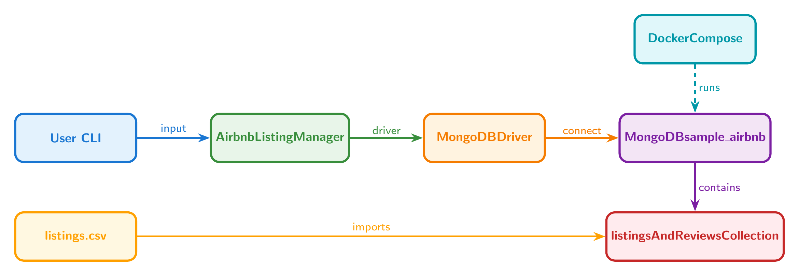
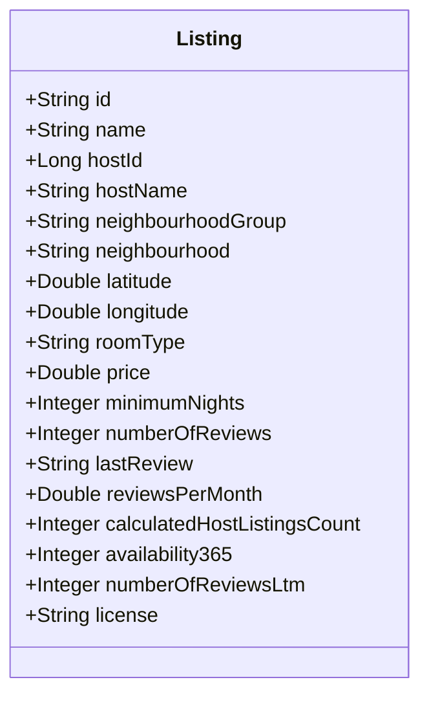
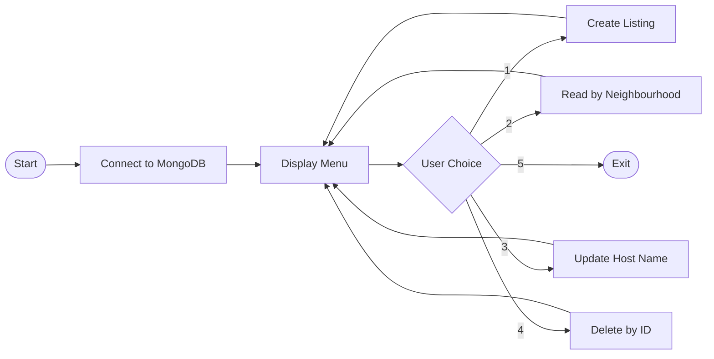

# MongoDB Airbnb Listing Manager

[](https://adoptium.net/)
[](https://www.mongodb.com/)
[](https://maven.apache.org/)
[](https://www.docker.com/)

A command-line CRUD application for managing Airbnb rental listings backed by MongoDB. Built to demonstrate document database operations with a real-world dataset of San Francisco Airbnb properties.

## Architecture



## Data Model

Each listing is stored as a MongoDB document in the `listingsAndReviews` collection:



## Application Flow



## Features

- **Create** — Add new Airbnb listings with full property details
- **Read** — Query listings by neighbourhood with formatted output
- **Update** — Modify host names on existing listings
- **Delete** — Remove listings by ID with confirmation prompts
- **Docker support** — One-command MongoDB setup via Docker Compose
- **Real dataset** — Includes ~7,800 San Francisco Airbnb listings

## Prerequisites

- **Java 17** or later ([Adoptium](https://adoptium.net/))
- **Maven 3.9+** ([download](https://maven.apache.org/download.cgi))
- **Docker** and **Docker Compose** ([Docker Desktop](https://www.docker.com/products/docker-desktop/))

## Quick Start

### 1. Start MongoDB with Docker

```bash
docker-compose up -d
```

Verify it's running:

```bash
docker ps
```

### 2. Load the dataset

```bash
docker exec -i mongodb_container mongoimport \
  --db sample_airbnb \
  --collection listingsAndReviews \
  --type csv \
  --headerline \
  --drop < data/listings.csv
```

### 3. Build and run

```bash
mvn clean compile exec:java -Dexec.mainClass="com.mongodb.airbnb.AirbnbListingManager"
```

Or build a JAR and run it:

```bash
mvn clean package
java -jar target/mongodb-airbnb-manager-1.0.0.jar
```

## Usage

Once running, you'll see an interactive menu:

```
+-------------------------------------------+
|           Airbnb Listing Manager          |
+-------------------------------------------+
| 1. Create Listing                         |
| 2. Read Listings by Neighbourhood         |
| 3. Update Listing Host Name               |
| 4. Delete Listing by ID                   |
| 5. Exit                                   |
+-------------------------------------------+
Choose an operation (1-5):
```

### Create a Listing

Enter property details interactively. The application prompts for all fields including ID, name, host info, location, room type, pricing, and availability.

```
--- Create New Listing ---
ID (String): 99999
Name: Cozy Studio near Golden Gate Park
Host ID (long): 12345
Host Name: Jane Doe
...
Listing created successfully!
```

### Read Listings by Neighbourhood

Search for all listings in a specific San Francisco neighbourhood:

```
Enter neighbourhood to fetch listings: Western Addition

--- Searching Listings in: Western Addition ---
--------------------
  ID: 958
  Name: Bright, Modern Garden Unit - 1BR/1BTH
  Host Name: Holly
  Neighbourhood: Western Addition
  Price: 158.0
--------------------
```

### Update a Host Name

Change the host name on an existing listing by its ID:

```
--- Update Listing Host Name ---
Enter the ID (String) of the listing to update: 958
Enter the new Host Name: Holly Smith
Listing updated successfully! (1 document modified)
```

### Delete a Listing

Remove a listing with confirmation:

```
--- Delete Listing by ID ---
Enter the ID (String) of the listing to delete: 99999
Are you sure you want to delete listing '99999'? (yes/no): yes
Listing deleted successfully!
```

## Project Structure

```
mongodb-airbnb-manager/
├── README.md
├── .gitignore
├── pom.xml
├── docker-compose.yml
├── data/
│   ├── README.md
│   └── listings.csv
└── src/
    └── main/
        └── java/
            └── com/
                └── mongodb/
                    └── airbnb/
                        ├── AirbnbListingManager.java
                        └── Listing.java
```

## Tech Stack

| Layer | Technology |
|-------|-----------|
| Language | Java 17 |
| Database | MongoDB 7.0 |
| Driver | MongoDB Java Sync Driver 5.1 |
| Build | Maven |
| Container | Docker + Docker Compose |

## Dataset

This project uses the San Francisco Airbnb listings dataset from [Inside Airbnb](http://insideairbnb.com/get-the-data/). The data includes property details, host information, location coordinates, pricing, availability, and review metrics for approximately 7,800 listings.

See [`data/README.md`](data/README.md) for the full schema and import instructions.
